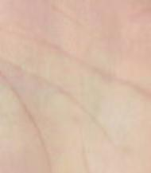
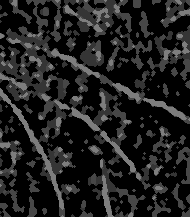
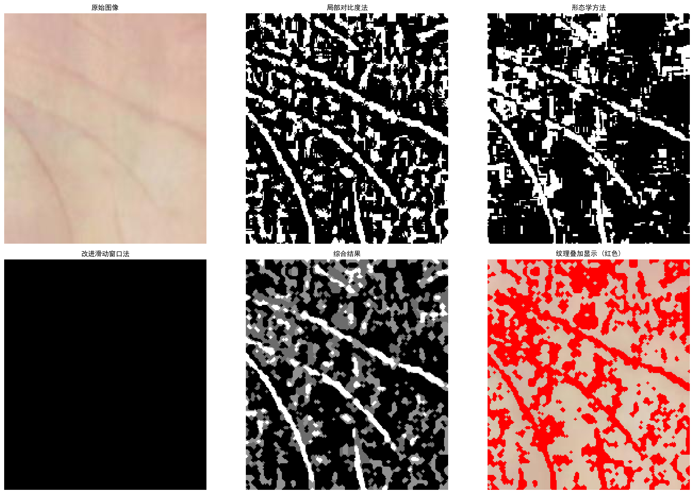
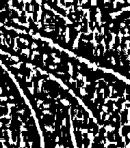
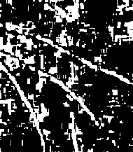

# 掌纹纹理提取 (Palmprint Texture Extraction)

基于多种图像处理技术的掌纹纹理提取项目，综合使用局部对比度法、形态学方法和改进滑动窗口法进行纹理提取。

## 项目特点

- **多种提取方法**：综合三种不同的纹理提取算法
- **四方向扫描**：滑动窗口法支持从左到右、从右到左、从上到下、从下到上四个方向
- **结果可视化**：自动生成对比图和叠加显示图
- **形态学后处理**：连接断裂纹理，去除噪点

## 输入图像



## 输出结果

### 综合结果



### 各方法对比



### 单独方法结果

| 局部对比度法 | 形态学方法 | 改进滑动窗口法 |
|:---:|:---:|:---:|
|  |  |  |

## 技术原理

### 1. 局部对比度法

纹理区域通常具有较低的像素值和较高的局部对比度。该方法通过计算局部均值和局部标准差来检测纹理区域。

**算法流程：**
1. 计算图像的局部均值（使用 block_size × block_size 的均值滤波）
2. 计算局部标准差
3. 设置阈值 = 局部均值 - k × 局部标准差
4. 像素值低于阈值的区域被识别为纹理

**参数：**
- `block_size`: 局部区域大小，默认 15
- `k`: 标准差系数，默认 0.4

### 2. 形态学方法

通过顶帽变换和黑帽变换提取局部较暗的区域，适用于提取细小的纹理特征。

**算法流程：**
1. 对图像进行顶帽变换（提取比周围亮的区域）
2. 对图像进行黑帽变换（提取比周围暗的区域）
3. 合并两种变换结果
4. 使用 Otsu 自动阈值进行二值化

**参数：**
- `kernel_size`: 结构元素大小，默认 7
- `iterations`: 迭代次数，默认 1

### 3. 改进滑动窗口法

使用二维窗口进行四方向扫描，通过比较窗口均值与中心像素值来判断纹理位置。

**算法流程：**
1. 使用二维窗口（宽度 × 高度）扫描图像
2. 计算窗口内像素均值
3. 判断窗口边缘像素是否小于均值的阈值比例
4. 四方向扫描合并结果
5. 形态学后处理（闭运算连接断裂纹理，开运算去除噪点）

**参数：**
- `window_width`: 窗口宽度，默认 15
- `window_height`: 窗口高度，默认 3
- `threshold_ratio`: 阈值比例，默认 0.8

### 4. 结果合并

将三种方法的结果按权重合并：
- 局部对比度法：权重 0.4
- 形态学方法：权重 0.3
- 滑动窗口法：权重 0.3

然后进行形态学后处理：
- 闭运算：连接断裂的纹理
- 开运算：去除小噪点

## 使用方法

### 环境要求

```bash
pip install opencv-python numpy matplotlib
```

### 运行

```bash
python texture_extraction.py
```

修改代码中的 `image_path` 变量以处理不同的图像：

```python
image_path = 'aa.jpg'  # 修改为你的图像路径
```

## 输出文件

运行后会生成以下文件：

| 文件名 | 说明 |
|--------|------|
| `texture_final_improved.png` | 综合纹理提取结果 |
| `texture_extraction_improved.png` | 方法对比可视化图 |
| `texture_local_contrast.png` | 局部对比度法结果 |
| `texture_morphology.png` | 形态学方法结果 |
| `texture_sliding_window.png` | 滑动窗口法结果 |

## 参数调优建议

如果提取效果不理想，可以尝试调整以下参数：

| 参数 | 当前值 | 调整建议 |
|------|--------|----------|
| `block_size` | 15 | 纹理较粗时增大，较细时减小 |
| `k` | 0.4 | 提取更多纹理时减小，减少噪声时增大 |
| `kernel_size` | 7 | 纹理较粗时增大 |
| `window_width` | 15 | 根据纹理宽度调整 |
| `window_height` | 3 | 根据纹理高度调整 |
| `threshold_ratio` | 0.8 | 提取更多纹理时增大，减少噪声时减小 |

## 许可证

MIT License
